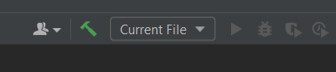
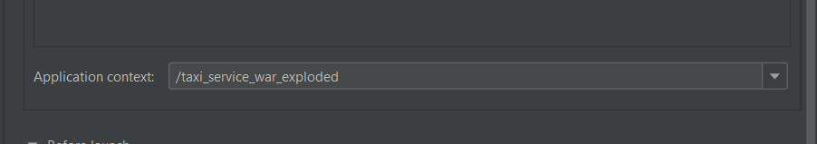

# TAXI-SERVICE 🚕
## 🖊️ Description
This is a simple application that allows you to work with a taxi service. This app follows SOLID principles and based on N-tier architecture. It supports registration, authentication, and all CRUD-based operations. The technologies that I used in this project made it possible to realize all the functionality that was conceived.
## 🏃 How to Install and Run the Project
1. Install JDK v11 or later
2. Clone this project to your JDK
3. Install MySQLWorkbench v8.0 or later
4. Create the shema with tables using a script from [this](src/main/resources/init_db.sql) file
5. Configure [ConnectionUtil.java](src/main/java/taxi/util/ConnectionUtil.java) file
6. Install Apache Tomcat v8.5.83 or later
7. [Configure Apache Tomcat in JDK](#configure-apache-tomcat)
8. Click on debug on the toolbar to use the application
## ⚙ Technologies
### **Web**
* Apache Tomcat v8.5.83 as servlet
* Javax Servlet API v4.0.1
* JSTL v1.2
### **Database**
* MySql Database v8.0.22
* JDBS driver for MySQL connector
### **Enviroments**
* MySqlWorkbench enviroment v8.0 CE
* IntelliJ IDEA
### **Others**
* Apache Maven as application builder
* JSP
* HTML
* CSS
## 👩‍💻 Features
This application provides an opportunity to register or authenticate as a driver. If you do not have your profile, you will not be able to use the functionality provided by this application.
#### **If you are a user then you can:**
* add a *new car/new manufacturer/driver to car*
* delete a *car/driver/manufacturer*
* get a list of *cars/drivers/manufacturers*
* get a list of your cars
## 📚 Project structure
The project is based on the n-tier architecture, which also follows the principles of SOLID, which provides:
* presentation layer
* service layer
* DAO layer
* Database
### **Structure of taxi-service database**

## Configure Apache Tomcat
1. On the toolbar, select Current File -> Edit Configurations

2. Add Apache Tomcat - Local
3. Click on Configure and choose the path to installed Apache Tomcat

4. Click on Fix

Select **project-name:war-exploded**

5. Delete text from Application context

Just leave it empty

6. Click OK

Back to [How to Install and Run the Project](#how-to-install-and-run-the-project)
